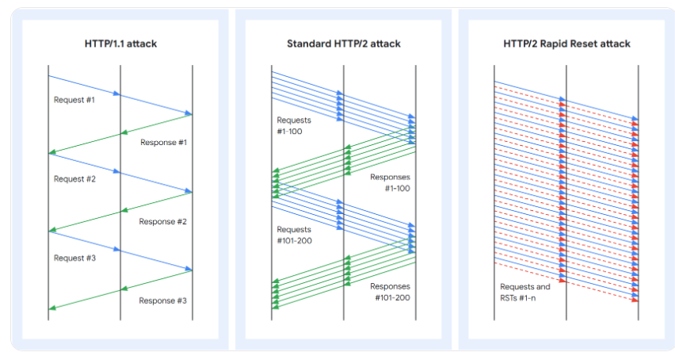
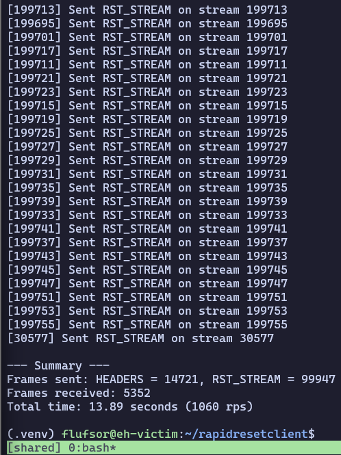
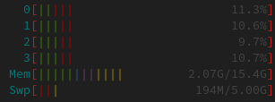
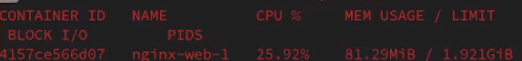
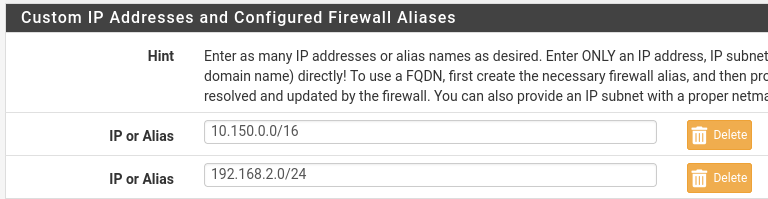
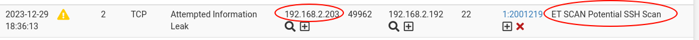

# Onderzoek Ethical Hacking: HTTP/2 Rapid Reset Attack (CVE-2023-44487)

## Introductie

In dit onderzoek gaan wij kennismaken met de Denial Of Service aanval genaamd **HTTP/2 Rapid Reset**. Deze aanval is ontdekt in oktober 2023 en zal volgens verschillende bronnen nog enkele jaren sporadisch opduiken. We hebben deze aanval gekozen omwille van zijn impact: alle webservers met het protocol HTTP/2 zijn namelijk vatbaar voor deze aanval indien deze niet voorzien zijn van de correcte instellingen.

In dit onderzoek zullen de volgende elementen aan bod komen:

- HTTP/2 Rapid Reset uitgelegd
- Waarom werkt deze aanval?
- Wat kunnen we tegen deze aanval doen?
- Demonstratie aanval

Link naar onze repository: [link](https://github.com/nvdg2/http2RapidReset)
<div style="page-break-after: always; visibility: hidden">
\pagebreak
</div>

## HTTP/2 Rapid Reset uitgelegd

_Deze sectie is gebaseerd op het grondig onderzoek van Juho Snellman en Daniele Lamartino. Link naar [website](https://cloud.google.com/blog/products/identity-security/how-it-works-the-novel-http2-rapid-reset-ddos-attack)_

### Algemene info

CVE-2023-44487 is een Volume Distributed Denial of Service. Dit betekent dat de aanval een zwakheid uitbuit, die het mogelijk maakt om de resources van een systeem in te palmen. Belangrijk om te begrijpen, is dat deze aanval niet gegarandeerd een systeem doet falen.

Afhankelijk van de hoeveelheid resources die de target machine heeft, is er een grote hoeveelheid aan computerkracht nodig om de aanval effectief te laten slagen. Denk maar aan 2 tot 10 tot duizenden computers.

Vooraleer we kunnen toelichten hoe de aanval werkt, is het belangrijk om te begrijpen hoe het HTTP/2 protocol werkt en welke eigenschap kwetsbaar is voor de aanval.

### Werking HTTP/2 streams

In normale omstandigheden opent een client een **HTTP/2 stream** met behulp van een request. De HTTP/2 server beantwoordt deze request met een response. Als resultaat is een HTTP/2 stream opgemaakt en kunnen pakketten uitgewisseld worden.

HTTP/2 heeft "stream multiplexing" als extra eigenschap. Dit is één van de belangrijkste kenmerken van dit protocol. Het geeft namelijk de mogelijkheid om meerdere streams tegelijkertijd te onderhouden en resulteert in een efficiënter gebruik van de gemaakte TCP connecties.

Bij HTTP/1 zou voor elk verzoek een nieuwe TCP connectie opgezet moeten worden. Bij HTTP/2 hoeft dit dus niet. Stream multiplexing maakt het namelijk mogelijk om meerdere "in-flight" requests te versturen, zonder meerdere individuele connecties te moeten beheren.

Als we dieper ingaan op de werking van HTTP/2 connecties, kunnen we vertellen dat een client de mogelijkheid heeft om meerdere streams tegelijkertijd te starten in een TCP connectie. Over elke stream wordt dan een HTTP verzoek verzonden. Dit principe wordt zeer belangrijk wanneer we verder gaan bekijken hoe deze denial of service werkt.

### Verschil normale DOS en HTTP/2 Rapid Reset

Laten we kort bekijken wat het verschil is tussen de Rapid Reset DOS en een normale HTTP DOS.

Onderstaande foto's geven het principe van de verschillende aanvallen duidelijk weer:



De eerste en de tweede aanval lijken sterk op elkaar: een client start een connectie met de server en de server antwoordt hierop. Het antwoorden op zo'n request kost computerkracht.

Wat er typisch gebeurt tijdens zo'n aanval, is dat de aanvaller zeer veel requests stuurt met behulp van een groot aantal machines (ook wel een botnet genoemd). De server probeert al deze verzoeken te beantwoorden, maar bezwijkt onder de druk. Als dit gebeurt, is de aanval succesvol.

Het enige verschil tussen de HTTP/1.1 en HTTP/2 aanval is dat het HTTP/2 protocol parallelle verzoeken accepteert door het ondersteunen van meerdere streams.

Nu komt de belangrijke eigenschap die de Rapid Reset aanval zo sterk maakt: in beide voorgaande aanvallen, antwoordde de server en wachtte de client op de request. **Bij Rapid Reset is dit niet het geval!**

### Waarom werkt deze aanval

De Rapid Reset aanval steunt op een eenvoudig principe: de client gaat een groot aantal streams creëren. Alleen hoeft de client niet te wachten op antwoord van de server. In plaats van te wachten, wordt gewoon nog een verzoek gestuurd voor een nieuwe stream en daarna nog één en nog één ...

Deze werkwijze is mogelijk omdat de client, meteen na het sturen van zijn verzoek, een RST_STREAM uitstuurt. Dit is een pakket dat aangeeft dat de client de connectie wilt afbreken.

Het "resetten" van deze stream kost echter resources voor de server, maar beïnvloedt de client niet. Als gevolg hiervan kan de client zeer veel streams starten en resetten. Vandaar de naam "HTTP/2 Rapid Reset".

Een bijkomend voordeel is dat het annuleren van een connectie ervoor zorgt dat het aantal open streams niet verhoogt. Hierdoor wordt de limiet van max toegelaten streams niet overschreden.

Tot slot is er nog een ander voordeel van deze aanval: door het direct annuleren van de verzoeken, stuurt de reverse proxy van de server geen antwoord. Dit zorgt ervoor dat de hacker niet moet beschikken over grote bandbreedtes. Dit zou namelijk wel nodig zijn om de antwoorden van de server te kunnen verwerken in klassieke aanvallen.

<div style="page-break-after: always; visibility: hidden">
\pagebreak
</div>

## Wat kunnen we tegen deze aanval doen

Ook al is de aanval nog niet lang bekend, er zijn al heel wat methoden om jezelf te beschermen tegen deze DDOS.

1. **Een wasstraat**: Een algemene oplossing om jezelf te beschermen tegen Distributed Denial of Services is het gebruiken van een wasstraat zoals Cloudflare of Google. Deze bedrijven hebben namelijk de capaciteit om grote hoeveelheden requests te absorberen en de legitieme requests door te laten naar de werkelijke eindbestemming. Meer informatie kan u terugvinden via de volgende [link](https://www.cloudflare.com/nl-nl/network-services/products/magic-transit/).

	Op deze manier heeft je site geen last van de effecten van deze aanval. Dit geldt ook voor de Rapid Reset aanval: ook al wordt de load grotendeels gevormd door HTTP/2 streams, er moeten nog altijd zeer veel requests naar de server gestuurd worden. Elke goede DDOS-bescherming zal de aanval herkennen en hierop anticiperen.

2. **Gebruik patches van software producenten**: Na het ontdekken van de aanval, hebben veel bedrijven zoals Cloudflare, Microsoft en Google onderzoek gedaan naar een eventuele oplossing. Er werd een oplossing gevonden, die heel wat bedrijven hebben geïmplementeerd in hun software. Zo hebben de volgende webservers de nodige acties ondernomen, zodat je veilig gebruik kan maken van HTTP/2:
	- [Nginx](https://www.nginx.com/blog/http-2-rapid-reset-attack-impacting-f5-nginx-products/)
	- [Netty](https://github.com/netty/netty/security/advisories/GHSA-xpw8-rcwv-8f8p)
	- [Haproxy](https://www.haproxy.com/blog/haproxy-is-not-affected-by-the-http-2-rapid-reset-attack-cve-2023-44487)
	- [nghttp2](https://github.com/nghttp2/nghttp2/security/advisories/GHSA-vx74-f528-fxqg)

	Indien je reeds gebruik maakt van deze webservers, update dan zeker je softwareversie. Op deze manier beschik je over alle patches die zijn uitgebracht. Eén van deze patches is nakijken hoeveel RST_STREAMS worden uitgestuurd. Bij een abnormaal aantal RST_STREAMS, zal de server de connectie met de client verbreken.

3. **Manuele limieten instellen**: Een aanbevolen actie is het correct zetten van de instellingen van je webserver. Op deze manier kan je eigenhandig de HTTP/2 Rapid Reset aanval mitigeren.

	> De onderstaande opties zijn gebaseerd op de syntax van Nginx. De benaming kan licht verschillen tussen verschillende webservers.

	De volgende instellingen worden best toegepast:
	
	- Het aantal `keepalive_requests` tot max **1000** zetten.
	- Het aantal `http2_max_concurrent_streams` wordt best niet boven **128** streams gezet.
	
	Daarnaast zijn er nog extra aanbevelingen:
	
	- Stel de `limit_conn` variabele in. Deze variabele limiteert het aantal connecties per client.
	- Ook de `limit_req` variabele wordt best ingesteld. Deze bepaalt hoeveel requests er maximaal per tijdseenheid verwerkt mogen worden.
	
	Aldus Micheal Vernik en Nina Forsyth.
	
4. **HTTP/2 protocol uitzetten**: Tot slot, indien je een snelle oplossing wilt, kan je tijdelijk het HTTP/2 protocol uitschakelen. De overzet van HTTP/2 en HTTP/1.1 is in normale omstandigheden geen grote taak en dus eenvoudig toe te passen.

	Een voorbeeld: in Nginx moet je enkel "http2" uit de volgende lijn weghalen om HTTP/2 te deactiveren: `listen 443 ssl http2;`.

<div style="page-break-after: always; visibility: hidden">
\pagebreak
</div>

## Demonstratie / handleiding

In onze demonstratie maken we gebruiken van een oudere nginx versie namelijk 1.23.2. Deze is ongeveer 1 jaar oud en bevat dus nog geen patches tegen de HTTP/2 Rapid Reset aanval. We hebben wel een aangepaste Nginx configuratie gebruikt, om HTTP/2 effectiever te maken tijdens de demonstratie. Deze kan u hieronder terugvinden:

```config
server {
    listen 80;
    listen 443 ssl http2;
    server_name ${NGINX_HOST};

    ssl_certificate /certs/ca.pem;
    ssl_certificate_key /certs/ca-key.pem;

    keepalive_requests 100000;
    http2_max_concurrent_streams 1000000;

    location / {
	root /usr/share/nginx/html;
	index index.html index.htm;
    }
}
```

<div style="page-break-after: always; visibility: hidden">
\pagebreak
</div>

De Nginx server draait in een docker container. De docker compose van de omgeving vindt u hieronder terug:

```yaml
version: '3.1'
services:
  web:
    image: nginx:1.23.2
    depends_on:
      - certs
    volumes:
     - ./templates:/etc/nginx/templates:ro
     - ./certs:/certs:ro
    ports:
     - 80:80
     - 443:443
    environment:
     - NGINX_HOST=kubernoodles.ap

  certs:
    image: stakater/ssl-certs-generator
    restart: "no"
    volumes:
      - ./certs:/certs
```

Doorheen de demonstratie hebben we gebruik gemaakt van het script in de volgende repository: [https://github.com/secengjeff/rapidresetclient](https://github.com/secengjeff/rapidresetclient)

<div style="page-break-after: always; visibility: hidden">
\pagebreak
</div>

### Voorbereiding

De repository beschrijft duidelijk welke stappen doorlopen moeten worden. Hieronder vindt u deze stappen kort samengevat om de hacking tool te installeren.

> Om gebruik te kunnen maken van de tool, moet "Go" geïnstalleerd zijn op het besturingssysteem.
> 
> Documentatie voor installatie: [link](https://go.dev/doc/install)
> 
> Wanneer Go succesvol is geïnstalleerd, kan je verder met de volgende stappen.

1. Ten eerste clone je de repository naar je lokale computer. Dit kan via het volgende commando:

```bash
git clone https://github.com/secengjeff/rapidresetclient.git
```

2. Vervolgens navigeer je met een terminal in de gekloonde repo en installeer je de nodige dependencies:

```go
go get golang.org/x/net/http2

go get golang.org/x/net/http2/hpack
```

3. Tot slot bouw je de hacking tool door het volgende commando te gebruiken:

```go
go build -o rapidresetclient
```

Als alles goed is verlopen, verschijnt het uitvoerbaar programma "rapidresetclient" in je huidige directory. Met dit programme werken wij verder om de aanval uit te voeren.

<div style="page-break-after: always; visibility: hidden">
\pagebreak
</div>

### Starten van de aanval

De aanval wordt uitgevoerd via het volgende commando:

```bash
./rapidresetclient -requests=100000 -url \ https://kubernoodles.ap/ -concurrency=6 -delay=1
```

Op de onderstaande foto kan u zien dat de aanval wordt uitgevoerd.



Vooraleer we kijken naar de resultaten op de server, willen we via onderstaande foto laten zien dat de aanval veel resources van de aanvallende computer vereist. Omdat de swap partitie in actie is moeten komen, betekent dat de aanval minstens 15 GB aan ram heeft gekost. Daarnaast waren er ook hoge CPU waarden tijdens de aanval zelf.



Tijdens sommige momenten ondervonden we zelfs dat onze computer de DOS uitschakelde om de CPU minder te belasten. Dit bewijst dat de aanval best door meerdere bots wordt uitgevoerd, aangezien deze ook intensief is voor de aanvallende machine.

Onderstaande foto toont het effect van 2 aanvallende computers. We zien dat de CPU resource van de container tot +- 26 procent werd ingenomen. We kunnen dus aannemen dat, wanneer we beschikken over meer computerkracht (circa 4 tot 5 computers), de aanval de container succesvol kan overbelasten.



We kunnen dus besluiten dat de aanval correct is verlopen, aangezien twee computers in normale omstandigheden nooit zoveel resources van een webserver vragen.

## Video

Tot slot vindt u hierbij een korte video waarbij twee computers de aanval uitvoeren op een docker container met kwetsbare HTTP/2 webserver: [video](https://apbe-my.sharepoint.com/:v:/g/personal/s130529_ap_be/EVb9-2HxQu1Ar528Z6gHoVoBUC0NWWO5rJ8vvV3IkrHPXQ)

<div style="page-break-after: always; visibility: hidden">
\pagebreak
</div>

## Uitbreiding

We hebben als uitbreiding getest of het Intrusion Prevention System [Snort](https://www.snort.org/) werkt tegen de HTTP/2 Rapid Reset DOS. Jammer genoeg heeft dit systeem de aanval niet geblokkeerd. Uit onderstaande video kunnen we volgende conclusies trekken :

- Alle regels worden gebruikt in Snort.
- De aanval geraakt door de firewall, ondanks de IPS die actief is.

Link naar video: [link](https://apbe-my.sharepoint.com/:v:/g/personal/s130529_ap_be/EcXyVmJtuThFrtRw6wiUfVcBzSWEPMkleJpbrIdrhmUbTw) (de muis op de VM werd niet goed opgevangen door OBS, excuses voor de haperende frames).

Hieronder vindt u nog de foto die laat zien welke netwerken Snort monitoren:



De aanvallende computer had IP-adres 192.168.2.203/24, wat betekent dat de IPS actief luistert naar alle communicatie van deze machine.

Daarnaast hebben we de IPS al actief connecties zien blokkeren: wanneer we via de remote SSH client van VSCode wilden verbinden met de target VM, blokkeerde Snort de connectie. De volgende logs waren toen ook gegenereerd:



---
Niels Van De Ginste
Tom Goedemé

## Bronnen

- Snellman, J., & Iamartino, D. (2023, 10 oktober). How it works: the novel HTTP/2 ‘Rapid Reset’ DDoS attack. _Google Cloud Blog_. [https://cloud.google.com/blog/products/identity-security/how-it-works-the-novel-http2-rapid-reset-ddos-attack](https://cloud.google.com/blog/products/identity-security/how-it-works-the-novel-http2-rapid-reset-ddos-attack)

- Pardue, L. (2023, 27 oktober). _HTTP/2 rapid reset: Deconstructing the record-breaking attack_. The Cloudflare Blog. [https://blog.cloudflare.com/technical-breakdown-http2-rapid-reset-ddos-attack/](https://blog.cloudflare.com/technical-breakdown-http2-rapid-reset-ddos-attack/)

- _HTTP/2 Rapid Reset Attack Protection | CloudFlare_. (z.d.). Cloudflare. Geraadpleegd op 30 november 2023, van [https://www.cloudflare.com/en-gb/h2/](https://www.cloudflare.com/en-gb/h2/)

- _CVE-details_. (2023, 29 november). Redhat. Geraadpleegd op 30 november 2023, van [https://access.redhat.com/security/cve/cve-2023-44487](https://access.redhat.com/security/cve/cve-2023-44487)

- Vernik, M., & Forsyth, N. (2023, 10 oktober). _HTTP/2 Rapid Reset Attack Impacting F5 NGINX Products_. Nginx. Geraadpleegd op 30 november 2023, van [https://www.nginx.com/blog/http-2-rapid-reset-attack-impacting-f5-nginx-products/](https://www.nginx.com/blog/http-2-rapid-reset-attack-impacting-f5-nginx-products/)

- Secengjeff. (2023, 10 oktober). GitHub - secengjeff/rapidresetclient: Tool for Testing Mitigations and Exposure to Rapid Reset DDOS (CVE-2023-44487). GitHub. Geraadpleegd op 3 december 2023, van [https://github.com/secengjeff/rapidresetclient](https://github.com/secengjeff/rapidresetclient)

- _SNORT - Network Intrusion Detection & Prevention System_. (z.d.). Geraadpleegd op 30 december 2023, van [https://www.snort.org/](https://www.snort.org/)
